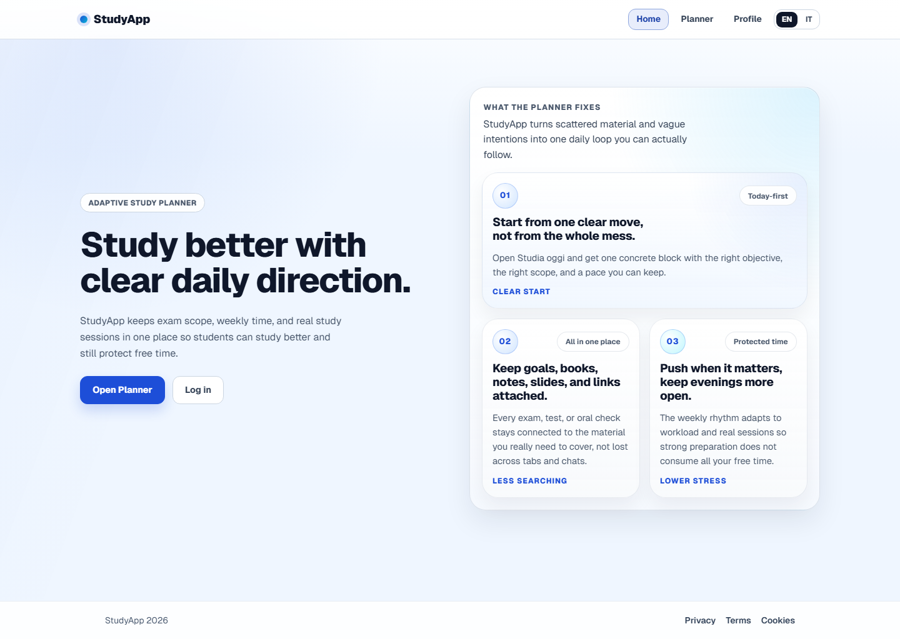
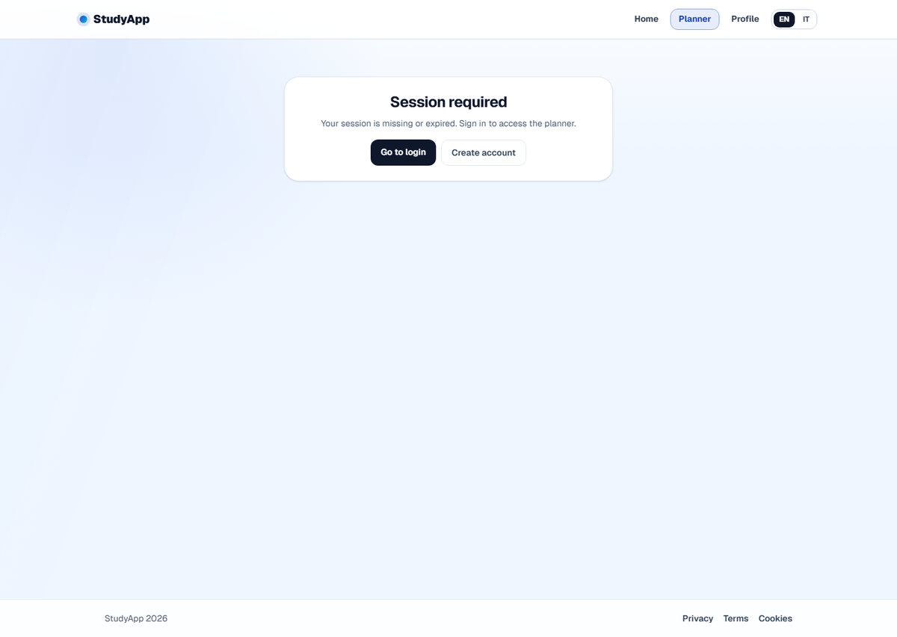

# StudyApp

StudyApp is an adaptive planning platform for students in high school, university, and self-study.

The objective is simple: convert study material, links, and student notes into a realistic weekly plan that helps users reach study goals with stronger preparation and lower stress.

## Preview





Website-ready demo video: [studyapp-demo.mp4](docs/readme-assets/studyapp-demo.mp4)

## Why This Project

- Students often know what to study but not how to pace it.
- This app translates workload into concrete weekly effort and daily actions.
- The roadmap includes AI support for study guidance and content understanding.

## Current MVP Scope

- Health endpoint to verify server and DB connectivity.
- Cookie-based authentication (register, login, logout, current session).
- Protected planner area with split feature pages (planner, study today, profile, subjects, objectives).
- Student profile update with weekly study capacity.
- Subject creation and listing for authenticated user.
- Goal creation and listing for authenticated user.
- Stochastic planning estimate with personalized calibration hooks.
- Focus lock timer with XP/streak reward loop.
- Rights-safe material discovery for public PDF/HTML links plus user-provided uploads.
- Responsive UI flow with dedicated pages instead of a single long console.

## Tech Stack

- `Next.js` (App Router)
- `TypeScript` (strict mode)
- `Prisma` ORM
- `PostgreSQL` (via Prisma local dev server)
- `Zod` for API input validation

## Local Setup

1. Install dependencies

```bash
npm install
```

2. Copy env defaults and decide how you want to enter the app

```bash
cp .env.example .env.local
```

Set `DEV_BOOTSTRAP_ENABLED=true` in `.env.local` only if you want the browser shortcut on `/` and `/login`.
For stable QA, prefer the seeded login flow described below.

3. Start the app

```bash
npm run dev
```

`npm run dev` starts Prisma local dev if needed and runs Next on `http://localhost:3000`.
Use `localhost`, not `127.0.0.1`, as the canonical local origin.
No Python or `venv` is required for the normal local flow.

4. Seed test data for visual QA and browser flows

```bash
npm run seed:simulation
```

Seeded login:
- `simulation-balanced@studyapp.local`
- `StudyApp2026!`

5. Open the app

Open `http://localhost:3000`.
You can still use `Enter dev app` when the dev bootstrap flag is enabled, but seeded login is the preferred testing path.

6. First-run database sync only when needed

```bash
npx prisma migrate dev
npx prisma generate
```

`AUTH_SECRET` is optional in local development because the app falls back to a dev-only secret outside production.

## Visual QA Workflow

- `npm run test:visual` captures screenshots for the key routes and saves them outside git in `qa/artifacts/screenshots/`.
- `npm run demo:record` records the demo flow and writes website-ready `MP4` and `GIF` artifacts to `qa/artifacts/demos/`.
- `npm run readme:assets` promotes the latest home screenshot plus the newest demo `GIF` and `MP4` into `docs/readme-assets/` for GitHub and portfolio reuse.
- The visual manifest lives in `qa/visual/manifest.ts`.
- The demo flow still records frames first, then encodes them locally so the route manifest stays reusable.
- Visual capture now degrades safely in local runs: public routes are still captured even when the seeded auth account is temporarily unavailable.

## API Endpoints (MVP)

- `GET /api/health`
- `POST /api/auth/register`
- `POST /api/auth/login`
- `POST /api/auth/logout`
- `GET /api/auth/me`
- `POST /api/students`
- `GET /api/subjects`
- `POST /api/subjects`
- `GET /api/exams`
- `POST /api/exams`
- `POST /api/planning/estimate`

## Project Structure

- `src/app/*`: UI pages and route handlers.
- `src/server/db/*`: database client and server-side data access.
- `src/server/http/*`: reusable API response helpers.
- `src/server/validation/*`: request validation schemas.
- `prisma/schema.prisma`: data model source of truth.
- `docs/*`: implementation and workflow documentation.
- `docs/ml-maturity-plan.md`: model roadmap from baseline to advanced ML.
- `docs/server-test-flow.md`: end-to-end auth/planner test checklist.
- `docs/interaction-os-skeleton.md`: human-AI operating framework for multi-role collaboration.

## Roadmap

1. Open-source web foundation (privacy-first, reproducible local setup, stable planner workflow).
2. Store-ready mobile app layer (shared logic, platform UI shell, offline-safe focus tracking).
3. Agentic coach layer (adaptive planning agent, proactive nudges, learning loop).

## Privacy And Open-Source Guardrails

- Never commit `.env*` files or machine-local credentials.
- Keep auth/testing shortcuts behind explicit dev-only environment flags.
- Keep public docs free of sensitive account details or personal access data.
- Keep mascot and visual assets under open-source compatible licensing.
- Keep generated QA screenshots and demo artifacts out of git.

## Contribution

Ideas and feedback are welcome.

If you want to collaborate, open an issue with:
- problem statement
- proposed direction
- expected user impact
